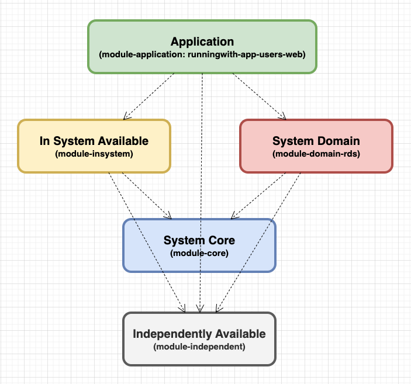

RunningWith
---

### 0. Description

- 온라인/오프라인 스터디 모집 및 관리 웹 어플리케이션
- [Troubleshoot]()

### 1. TECH

- Backend: Java 17, SpringBoot 3, Junit5, Mockito, JPA with QueryDSL
- CI/CD: [Github Actions](https://docs.github.com/ko/actions)
- Infrastructure: AWS ECS with Fargate

### 2. [Module-Structure](./docs/module/README.md)

- gradle based on multi-module
- `module-application:runningwith-app-users-web` is the Web Application Server for Users

### 3. How to build project

- `module-application:runningwith-app-users-web`: `./gradlew :module-application:runningwith-app-users-web:build`

### 4. ETC

-

### 5. Future Updates

- 네이버, 구글 OAuth 로그인
- 오프라인 스터디 설정 시 장소 검색 연동
- 온라인 스터디 설정 시 WebRTC 기반 영상 통신
