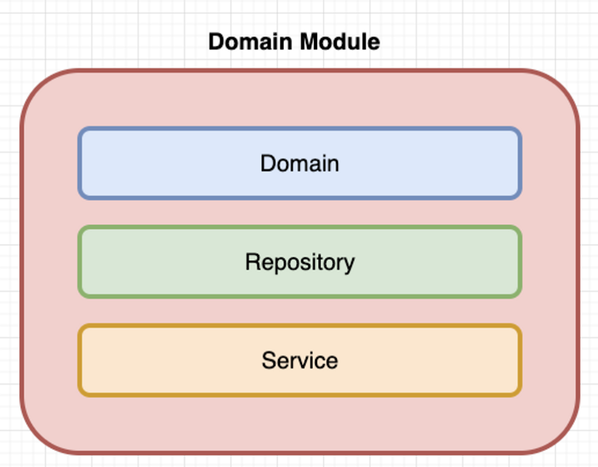

# Multi Module

---

**멀티 모듈로 개발을 하려는 이유는**

1. 동일한 도메인을 사용하는 어플리케이션 2개 이상 계획 중이다.
2. 시스템의 중심 Domain 이 가져야할 구조와 규칙 등을 동일하게 모든 어플리케이션 으로 가져갈 것이다.
3. 모듈을 계층화하여서 코드 중복을 방지할 것이다.
4. 모듈 간에 상호 의존성을 최소화하기 위하여 위 사진처럼 단방향 참조 모듈 구성을 할 것이다.

---

# Independently Available(독립 모듈 계층)

- 시스템과 무관하게 어디에서나 사용 가능한 라이브러리 성격의 모듈을 이 계층에 배치할 것이다.
- **언제든 이 계층의 모듈을 대처할 탄탄한 라이브러리가 등장하면 이 모듈은 제거할 것이므로, 프로젝트 내에서 의존관계를 두지 않아야 한다.**

---

# System Core(공통 모듈 계층)

- 독립 모듈 계층을 제외한 모든 모듈에서 사용할 수 있는 것들을 이 계층에 배치할 것이다.
    - ex) Type,Util 등을 정의
- **이 계층에서 모듈 간 의존성이 높아질 수 있으므로, 가능하면 사용하지 않을것이다.**
- 시스템 내 모든 모듈이 의존할 수 있을만큼 얇은 의존성을 제공해야 하므로 프로젝트 내 어떤 모듈도 의존하지 않는다.

---

# [System Domain(도메인 모듈 계층)](../../module-domain-rds/README.md)

- **이 계층은 오로지 도메인에만 집중할 것이고, 이 계층은 서비스 비즈니스를 몰라야 한다.**
- **하나의 모듈은 최대 하나의 인프라스트럭처에 대한 책임만 갖는다**
    - 하나의 모듈은 최대 하나의 인프라스트럭처를 갖는 것은 의존성의 전파를 방지하기 위해서서이다.

- **Domain**
    - Java Class로 표현된 도메인 Class 들이 이곳에 위치한다.
    - JPA를 기준으로, 테이블과 매핑되는 클래스들이 위치하는 곳이다.
- **Domain Repository**
    - 도메인의 CRUD 역할을 담당한다.
    - **모든 CRUD 역할을 이곳에서만 하도록 하지는 않는다.**
    - **이 모듈은 시스템에서 가장 보호받아야 하며, 가장 견고해야 할 모듈이므로, 이 모듈에서 CRUD 에 대한 작성을 할 때 많은 고민을 해야 한다.**
- **Domain Service**
    - 이 계층은 도메인의 비즈니스를 책임진다.
    - 그렇기 때문에 도메인이 갖는 비즈니스가 단순하다면 이 계층은 생기지 않을수도 있다.
    - 이 계층에서 `트랜잭션의 단위`를 정의하여,`요청 데이터를 검증`할것이고,`이벤트를 발생`하는 일 등 도메인의 비즈니스를 담당할 것이다.

---

# In System Available(내부 모듈 계층)

- 저장소, 도메인 외 시스템에서 필요한 모듈을 이 계층에 둘 것이다.
    - ex) `runningwith-core-web`: Web 설정을 사용하는 프로젝트에서 사용하는 모듈들(웹에 대한 공통 설정, 웹 보안, 로깅 등)
    - ex) `runningwith-xxx-event-publisher` :  특정 이벤트에 대한 처리를 담당하는 모듈등
    - ex) `runningwith-xxx-client` : 외부의 xxx 시스템과 통신을 책임지는 모듈이며 각 외부 시스템별로 따로 모듈을 만들 것이다.
- 이 계층은 **어플리케이션,도메인 비즈니스를 모르게 할 것이다.**

---

# In System Available(어플리케이션 모듈 계층)

- 어플리케이션 모듈은 하위 계층에 있는 모듈을 조립하여 서비스 비즈니스를 완성시키는 계층이다.
- ex) `runningwith-external-api` , `runningwith-app-web`