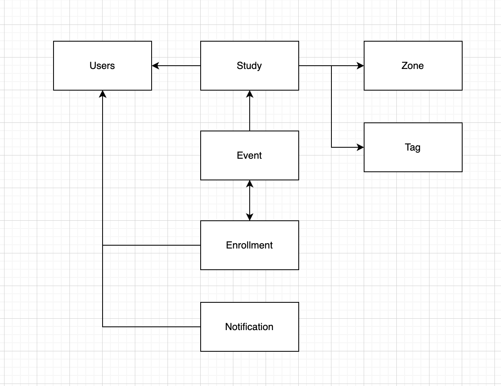
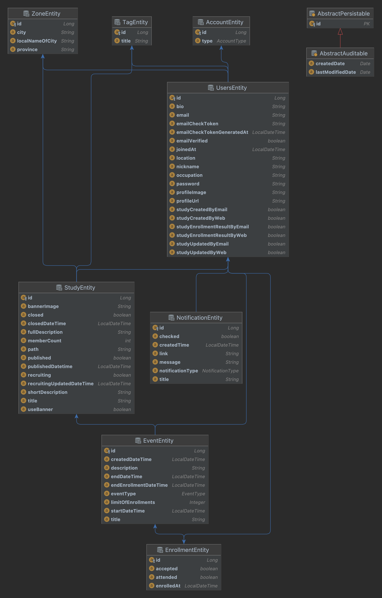

# module-domain-rds

---

# 0. Description

- This module is responsible for Domain
- This consists of jpa and mariadb

---

# 1. Module Rules

---

# 2. [Added Modules](./build.gradle)

- `spring-data-jpa`
- `querydsl`
- `mariadb-java-client`

---

# 3. Why mariadb

---

# 4. ERD

---

# 5. JPA Relation

