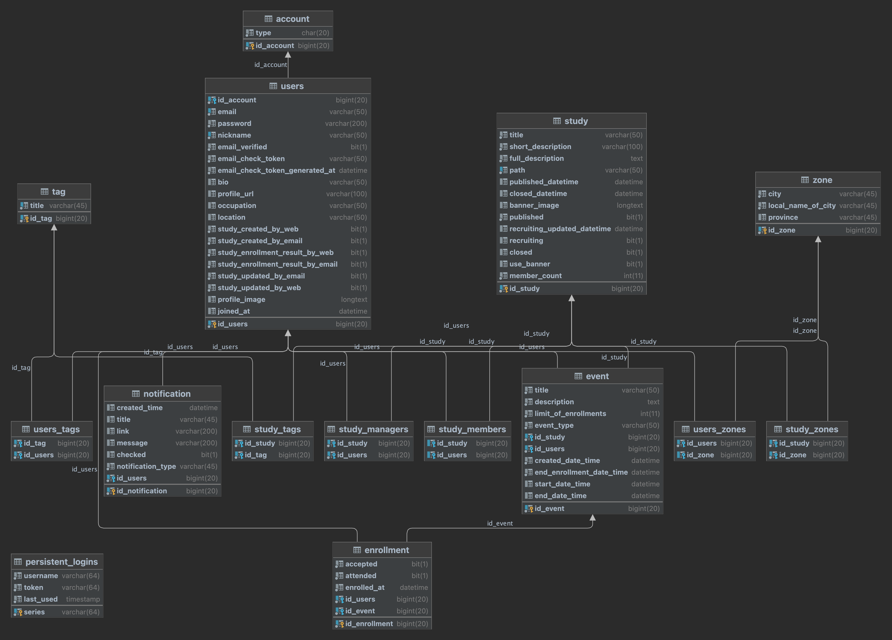

# module-domain-rds

---

# 0. Description

- This module is responsible for Domain
- This consists of jpa, mariadb connector and querydsl

---

# 1. Module Rules

### Transaction

- This module layer is not responsible for service transactions.
- There should be no service-related logic in this layer.

### Naming

- Camelcase variable in Entity names clearly specify column naming.
- An entity class appends Entity to the end of the variable name.

---

# [2. Added Modules](./build.gradle)

- `spring-data-jpa`
- `querydsl`
- `mariadb-java-client`

---

# 4. ERD

---

# 5. JPA Relation

